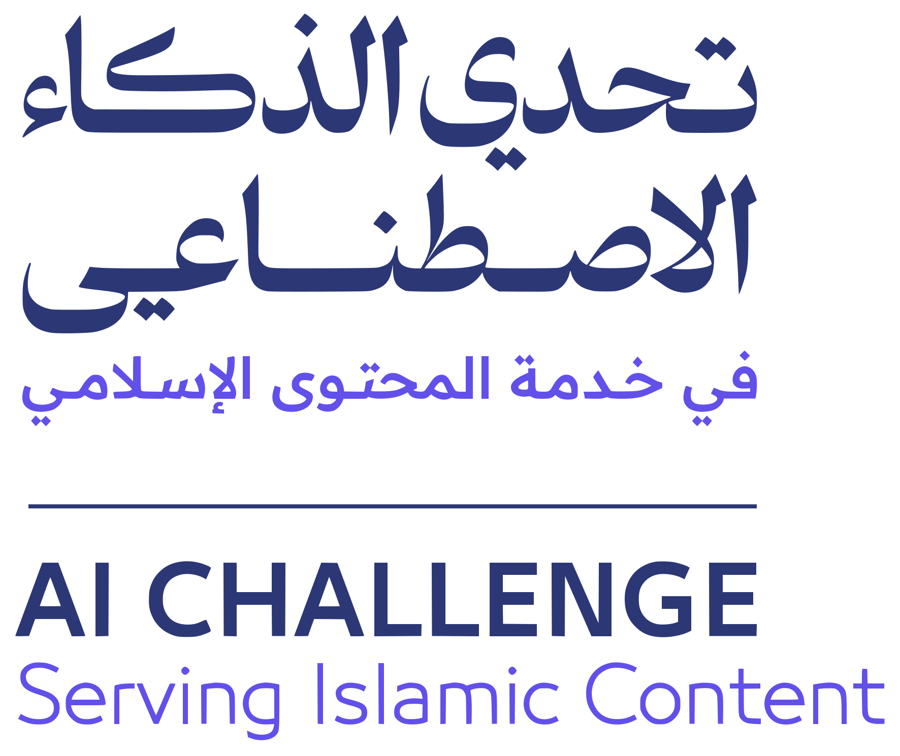
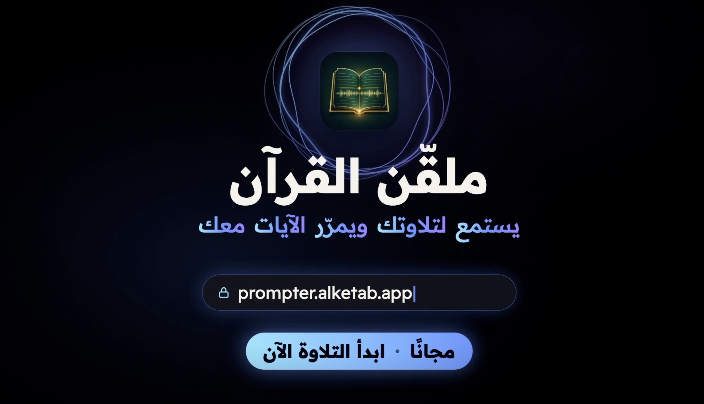

<p align="center">
  <a href="https://islamicaich.org">
    <picture>
      <source media="(prefers-color-scheme: dark)" srcset="islamicaich-dark.svg">
      
    </picture>
  </a>
</p>

<p align="center">
  <a href="https://prompter.alketab.app"></a>
</p>

<p align="center"><b>Quran Prompter</b> — it listens to your recitation and scrolls with you</p>

<p align="center">Project by <a href="https://x.com/itarek"><b>Tarek Mansour</b></a> · <a href="https://x.com/itarek">@itarek</a></p>

<p align="center">
  <a href="https://prompter.alketab.app"></a>
  <a href="https://youtu.be/nyBEyUz9sbM"></a>
</p>

<p align="center">
  
  
  
  
  
  
  <a href="LICENSE"></a>
</p>

Start reciting from anywhere in the Quran. The prompter finds your place,
follows you word by word, colours every word you recite, and scrolls the ayahs
with you — without touching the phone. The recitation model runs **entirely in
the browser**: your voice never leaves your device, and nothing is sent to any
server.

- **Four modes** — Reading (keeps your place and rolls into the next surah),
  Recognize (follows any reciter, wherever they start), Prayer (finds
  Al-Fātiḥah faster at every rak‘ah), Review (words stay hidden until you
  recite them).
- **The meaning of the ayah you are reciting**, in its own sheet: the Arabic
  tafsir (التفسير الميسر) and seven languages built in, and every translation
  QuranEnc.com publishes — 57 languages — a tap away. Approved human
  translations only, shown exactly as published.
- **For anyone who does not read Arabic well**: Latin-letter pronunciation
  under every word, and a tap on any word plays it.
- **The next word is lit** ahead of the cursor, so the page keeps pace with the
  reciter.
- Arabic and English interfaces; installs as an app; works with no network
  after the first visit.

This repository holds both the site and the engine it runs on:

```text
Engine/          the recitation engine
QuranPrompter/   the site → prompter.alketab.app
```

## Quick start

```bash
npm install
npm run build -w Engine
QT_MODEL_URL=https://prompter.alketab.app/models/quran_phoneme_zipformer.onnx \
  npm run fetch-model -w QuranPrompter   # the 72 MB recognition model
npm run dev -w QuranPrompter             # http://localhost:5173, allow the mic
npm test -w Engine                       # 114 tests, ~10 s
npm test -w QuranPrompter                # 80 tests of the site, ~1 s
```

The model is the only thing not in the repository (72 MB). The live site serves
the exact same file, which is why the command above always works; a local copy
works too:

```bash
QT_MODEL=/path/to/quran_phoneme_zipformer.onnx npm run fetch-model -w QuranPrompter
```

No microphone handy? Put a 16 kHz mono WAV of a recitation in
`QuranPrompter/public/test/` and play it through the whole pipeline:

```bash
ffmpeg -i recitation.mp3 -ac 1 -ar 16000 QuranPrompter/public/test/fatiha.wav
# then open http://localhost:5173/?audio=/test/fatiha.wav&speed=1
```

`everyayah.com/data/Husary_128kbps/001001.mp3` and its neighbours give any
ayah by any reciter.

## How it works, in one paragraph

One edit-distance table is kept over the loaded surah. Every phoneme the model
emits updates one column of it, and **the cursor is simply the cheapest cell** —
jumps, repeats and skipped words are cheaper or dearer paths, not special
cases. Word colours are traced back from the trail of cursor positions once the
next few sounds have arrived. Finding the place in the first instance is a
5-gram index over the whole Quran, verified by alignment.

## Status

**Live, and measured.**

- **Deployed** at <https://prompter.alketab.app>; the version is shown in the
  About page's footer.
- **194 automated tests** — 114 for the engine, 80 for the site — including the
  feature frontend matching the Python reference frame for frame, and
  onnxruntime-web decoding a clip to the same tokens as the reference
  implementation.
- **المتشابهات measured:** 788 ayahs have a twin elsewhere; Ar-Rahman's 78 ayahs
  and 31 refrains, Al-Mursalat's 50, and Al-Kafirun from a phone microphone all
  track end to end through the real model with **no wrong cursor move**.
- **Every translation checked:** the regenerator refuses any translation unless
  all 6,236 ayahs line up with the corpus, and the site checks again before
  showing one.
- **Not yet:** a corpus run over a large body of recordings from many reciters,
  and a field study with users who do not read Arabic.

## Sources, tools and licences

**The engine (`Engine/`) and the Quran Prompter (`QuranPrompter/`) are under
the Quran-Lab No-Profit License 1.2, the same license as the model they run** —
[LICENSE](LICENSE); each package also carries it as its own `LICENSE`. It is
never to be charged for: no payment, subscription, paywall or advertising on
anything the model powers.

[NOTICE.md](NOTICE.md) lists every source and how its terms are met:

| what | from | licence |
| --- | --- | --- |
| the recognition model, its phoneme reference and token lexicon | Quran Lab — <https://quranlab.ai> | Quran-Lab NPL-1.2 |
| translations of the meanings | QuranEnc.com — the Noble Quran Encyclopedia | QuranEnc's terms: shown unmodified, credited, versioned |
| the mushaf font, KFGQPC Hafs Smart | King Fahd Glorious Quran Printing Complex | the Complex's licence: free to use and distribute, never sold or modified |
| the interface font, Readex Pro | The Readex Pro Project Authors | SIL OFL 1.1 |
| onnxruntime-web | Microsoft | MIT |
| word recitation audio, played on tap | Quran.com (`audio.qurancdn.com`) | streamed, not redistributed |
